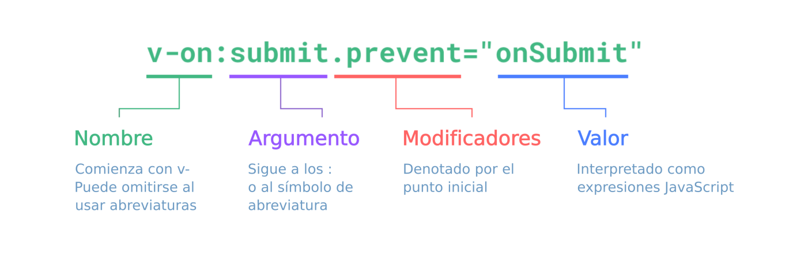

# Sintaxis de la Template

Vue utiliza una sintaxis de template basada en HTML que te permite vincular declarativamente el renderizado del DOM con los datos de la instancia del componente subyacente. Todas las templates de Vue son HTML sintácticamente válido que pueden ser analizados por navegadores y por analizadores de HTML que cumplan las especificaciones.

Entre bastidores, Vue compila las templates en código JavaScript altamente optimizado. Combinado con el sistema de reactividad, Vue es capaz de descifrar de manera inteligente la cantidad mínima de componentes a re-renderizar y aplicar la cantidad mínima de manipulaciones al DOM cuando cambia el estado de la aplicación.

Si estás familiarizado con los conceptos de Virtual DOM y prefieres la potencia bruta de JavaScript, también puedes [escribir directamente funciones de renderizado](/guide/extras/render-function.html) en lugar de templates, con soporte opcional para JSX. Sin embargo, ten en cuenta que no disfrutarás el mismo nivel de optimizaciones en tiempo de compilación como con las plantillas.

## Interpolación de Texto

La forma más básica de vinculación de datos es la interpolación de texto utilizando la sintaxis de "Mustache" o bigotes (dobles llaves):

```vue-html
<span>Mensaje: {{ msg }}</span>
```

La etiqueta del mustache se reemplazará con el valor de la propiedad `msg` de la instancia del componente correspondiente. También se actualizará cada vez que cambie la propiedad `msg`.

## HTML Puro

Los dobles mustaches interpretan los datos como texto sin formato, no como HTML. Para generar HTML real, necesitarás usar la [directiva `v-html`](/api/built-in-directives.html#v-html):

```vue-html
<p>Usando interpolación de texto: {{ rawHtml }}</p>
<p>Usando la directiva v-html: <span v-html="rawHtml"></span></p>
```

<script setup>
  const rawHtml = '<span style="color: red">Esto debería ser rojo.</span>'
</script>

<div class="demo">
  <p>Usando interpolación de texto: {{ rawHtml }}</p>
  <p>Usando la directiva v-html: <span v-html="rawHtml"></span></p>
</div>

Aquí nos encontramos con algo nuevo. El atributo `v-html` que estás viendo se llama **directiva**. Las directivas tienen el prefijo `v-` para indicar que son atributos especiales proporcionados por Vue y, como habrás adivinado, aplican un comportamiento reactivo especial al DOM renderizado. Básicamente estamos diciendo "manten actualizado el HTML interno de este elemento con la propiedad `rawHtml` en la instancia activa actual".

El contenido de `span` se reemplazará con el valor de la propiedad `rawHtml`, interpretado como HTML sin formato: los datos vinculados se ignoran. Ten en cuenta que no puedes usar `v-html` para componer templates parciales, porque Vue no es un motor de templates basado en cadenas. En su lugar, se prefieren los componentes como unidad fundamental para la reutilización y composición de la interfaz de usuario.

:::warning Advertencia de seguridad
El HTML arbitrario renderizado dinámicamente en tu sitio web puede ser muy peligroso porque puede conducir fácilmente a [vulnerabilidades XSS](https://es.wikipedia.org/wiki/Cross-site_scripting). Utiliza `v-html` solo en contenido confiable y **nunca** en contenido proporcionado por el usuario.
:::

## Enlaces de Atributos

Los mustaches no se pueden usar dentro de los atributos HTML. En su lugar, utiliza una directiva [`v-bind`](/api/built-in-directives.html#v-bind):

```vue-html
<div v-bind:id="dynamicId"></div>
```

La directiva `v-bind` le indica a Vue que mantenga el atributo `id` del elemento sincronizado con la propiedad `dynamicId` del componente. Si el valor vinculado es `null` o `undefined`, el atributo se eliminará del elemento renderizado.

### Abreviatura

Debido a que `v-bind` se usa con tanta frecuencia, tiene una sintaxis abreviada dedicada:

```vue-html
<div :id="dynamicId"></div>
```

Los atributos que comienzan con `:` pueden verse un poco diferentes del HTML normal, pero de hecho es un carácter válido para los nombres de atributos y todos los navegadores compatibles con Vue pueden analizarlo correctamente. Además, no aparecen en el renderizado final. La sintaxis abreviada es opcional, pero probablemente la apreciarás cuando aprendas más sobre su uso más adelante.

> Para el resto de la guía, usaremos la sintaxis abreviada en los ejemplos de código, ya que es la más comúnmente usada para los desarrolladores de Vue.

### Atributos Booleanos

Los [atributos booleanos](https://html.spec.whatwg.org/multipage/common-microsyntaxes.html#boolean-attributes) son atributos que pueden indicar valores verdadero/falso por su presencia en un elemento. Por ejemplo, [`disabled`](https://developer.mozilla.org/en-US/docs/Web/HTML/Attributes/disabled) es uno de los atributos booleanos más comúnmente utilizados.

`v-bind` funciona un poco diferente en este caso:

```vue-html
<button :disabled="isButtonDisabled">Button</button>
```

El atributo `disabled` se incluirá si `isButtonDisabled` tiene un [valor verdadero (thruty)](https://developer.mozilla.org/en-US/docs/Glossary/Truthy). También se incluirá si el valor es una cadena vacía, manteniendo la coherencia con `<button disabled="">`. Para otros valores falsos, se omitirá el atributo.

### Vinculación Dinámica de Múltiples Atributos

Si tienes un objeto de JavaScript representando múltiples atributos que se ve así:

<div class="composition-api">

```js
const objectOfAttrs = {
  id: 'container',
  class: 'wrapper'
}
```

</div>
<div class="options-api">

```js
data() {
  return {
    objectOfAttrs: {
      id: 'container',
      class: 'wrapper'
    }
  }
}
```

</div>

Puedes vincularlos a un único elemento usando `v-bind` sin un argumento:

```vue-html
<div v-bind="objectOfAttrs"></div>
```

## Usando Expresiones JavaScript

So far we've only been binding to simple property keys in our templates. But Vue actually supports the full power of JavaScript expressions inside all data bindings:

```vue-html
{{ number + 1 }}

{{ ok ? 'YES' : 'NO' }}

{{ message.split('').reverse().join('') }}

<div :id="`list-${id}`"></div>
```

These expressions will be evaluated as JavaScript in the data scope of the current component instance.

In Vue templates, JavaScript expressions can be used in the following positions:

- Inside text interpolations (mustaches)
- In the attribute value of any Vue directives (special attributes that start with `v-`)

### Expressions Only

Each binding can only contain **one single expression**, so the following will **NOT** work:

```vue-html
<!-- this is a statement, not an expression: -->
{{ var a = 1 }}

<!-- flow control won't work either, use ternary expressions -->
{{ if (ok) { return message } }}
```

### Calling Functions

It is possible to call a component-exposed method inside a binding expression:

```vue-html
<span :title="toTitleDate(date)">
  {{ formatDate(date) }}
</span>
```

:::tip
Functions called inside binding expressions will be called every time the component updates, so they should **not** have any side effects, such as changing data or triggering asynchronous operations.
:::

### Restricted Globals Access

Template expressions are sandboxed and only have access to a [restricted list of globals](https://github.com/vuejs/core/blob/main/packages/shared/src/globalsWhitelist.ts#L3). The list exposes commonly used built-in globals such as `Math` and `Date`.

Globals not explicitly included in the list, for example user-attached properties on `window`, will not be accessible in template expressions. You can, however, explicitly define additional globals for all Vue expressions by adding them to [`app.config.globalProperties`](/api/application.html#app-config-globalproperties).

## Directivas

Directives are special attributes with the `v-` prefix. Vue provides a number of [built-in directives](/api/built-in-directives.html), including `v-html` and `v-bind` which we have introduced above.

Directive attribute values are expected to be single JavaScript expressions (with the exception of `v-for`, `v-on` and `v-slot`, which will be discussed in their respective sections later). A directive's job is to reactively apply updates to the DOM when the value of its expression changes. Take [`v-if`](/api/built-in-directives.html#v-if) as an example:

```vue-html
<p v-if="seen">Now you see me</p>
```

Here, the `v-if` directive would remove / insert the `<p>` element based on the truthiness of the value of the expression `seen`.

### Arguments

Some directives can take an "argument", denoted by a colon after the directive name. For example, the `v-bind` directive is used to reactively update an HTML attribute:

```vue-html
<a v-bind:href="url"> ... </a>

<!-- shorthand -->
<a :href="url"> ... </a>
```

Here `href` is the argument, which tells the `v-bind` directive to bind the element's `href` attribute to the value of the expression `url`. In the shorthand, everything before the argument (i.e. `v-bind:`) is condensed into a single character, `:`.

Another example is the `v-on` directive, which listens to DOM events:

```vue-html
<a v-on:click="doSomething"> ... </a>

<!-- shorthand -->
<a @click="doSomething"> ... </a>
```

Here the argument is the event name to listen to: `click`. `v-on` is one of the few directives that also have a corresponding shorthand, with its shorthand character being `@`. We will talk about event handling in more detail too.

### Dynamic Arguments

It is also possible to use a JavaScript expression in a directive argument by wrapping it with square brackets:

```vue-html
<!--
Note that there are some constraints to the argument expression,
as explained in the "Dynamic Argument Value Constraints" and "Dynamic Argument Syntax Constraints" sections below.
-->
<a v-bind:[attributeName]="url"> ... </a>

<!-- shorthand -->
<a :[attributeName]="url"> ... </a>
```

Here `attributeName` will be dynamically evaluated as a JavaScript expression, and its evaluated value will be used as the final value for the argument. For example, if your component instance has a data property, `attributeName`, whose value is `"href"`, then this binding will be equivalent to `v-bind:href`.

Similarly, you can use dynamic arguments to bind a handler to a dynamic event name:

```vue-html
<a v-on:[eventName]="doSomething"> ... </a>

<!-- shorthand -->
<a @[eventName]="doSomething">
```

In this example, when `eventName`'s value is `"focus"`, `v-on:[eventName]` will be equivalent to `v-on:focus`.

#### Dynamic Argument Value Constraints

Dynamic arguments are expected to evaluate to a string, with the exception of `null`. The special value `null` can be used to explicitly remove the binding. Any other non-string value will trigger a warning.

#### Dynamic Argument Syntax Constraints

Dynamic argument expressions have some syntax constraints because certain characters, such as spaces and quotes, are invalid inside HTML attribute names. For example, the following is invalid:

```vue-html
<!-- This will trigger a compiler warning. -->
<a :['foo' + bar]="value"> ... </a>
```

If you need to pass a complex dynamic argument, it's probably better to use a [computed property](./computed.html), which we will cover shortly.

When using in-DOM templates (templates directly written in an HTML file), you should also avoid naming keys with uppercase characters, as browsers will coerce attribute names into lowercase:

```vue-html
<a :[someAttr]="value"> ... </a>
```

The above will be converted to `:[someattr]` in in-DOM templates. If your component has a `someAttr` property instead of `someattr`, your code won't work.

### Modifiers

Modifiers are special postfixes denoted by a dot, which indicate that a directive should be bound in some special way. For example, the `.prevent` modifier tells the `v-on` directive to call `event.preventDefault()` on the triggered event:

```vue-html
<form @submit.prevent="onSubmit">...</form>
```

You'll see other examples of modifiers later, [for `v-on`](./event-handling.html#event-modifiers) and [for `v-model`](./forms.html#modifiers), when we explore those features.

And finally, here's the full directive syntax visualized:



<!-- https://www.figma.com/file/BGWUknIrtY9HOmbmad0vFr/Directive -->
